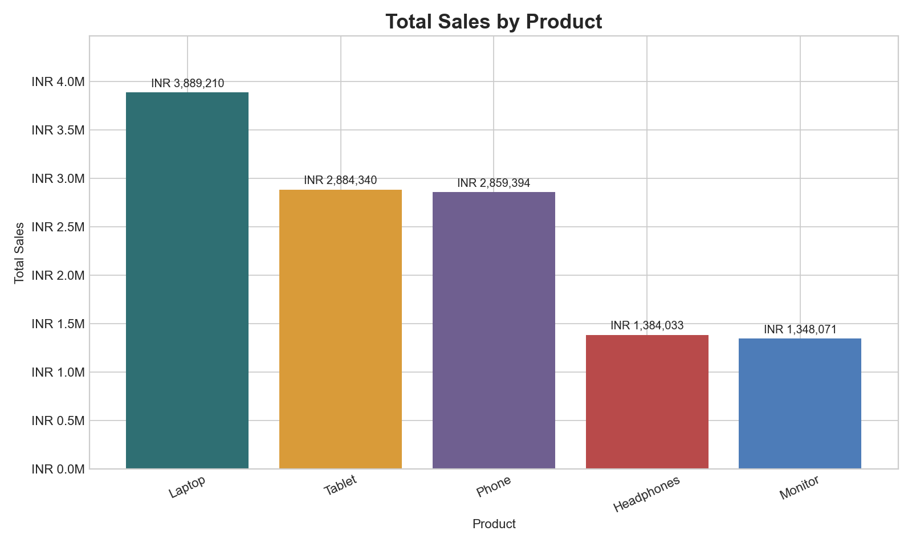
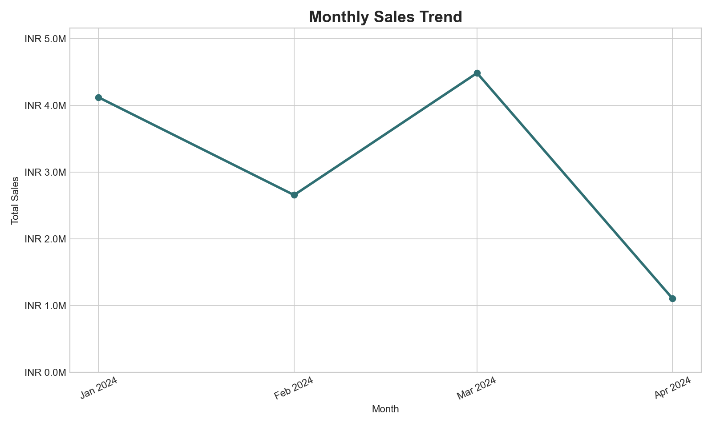
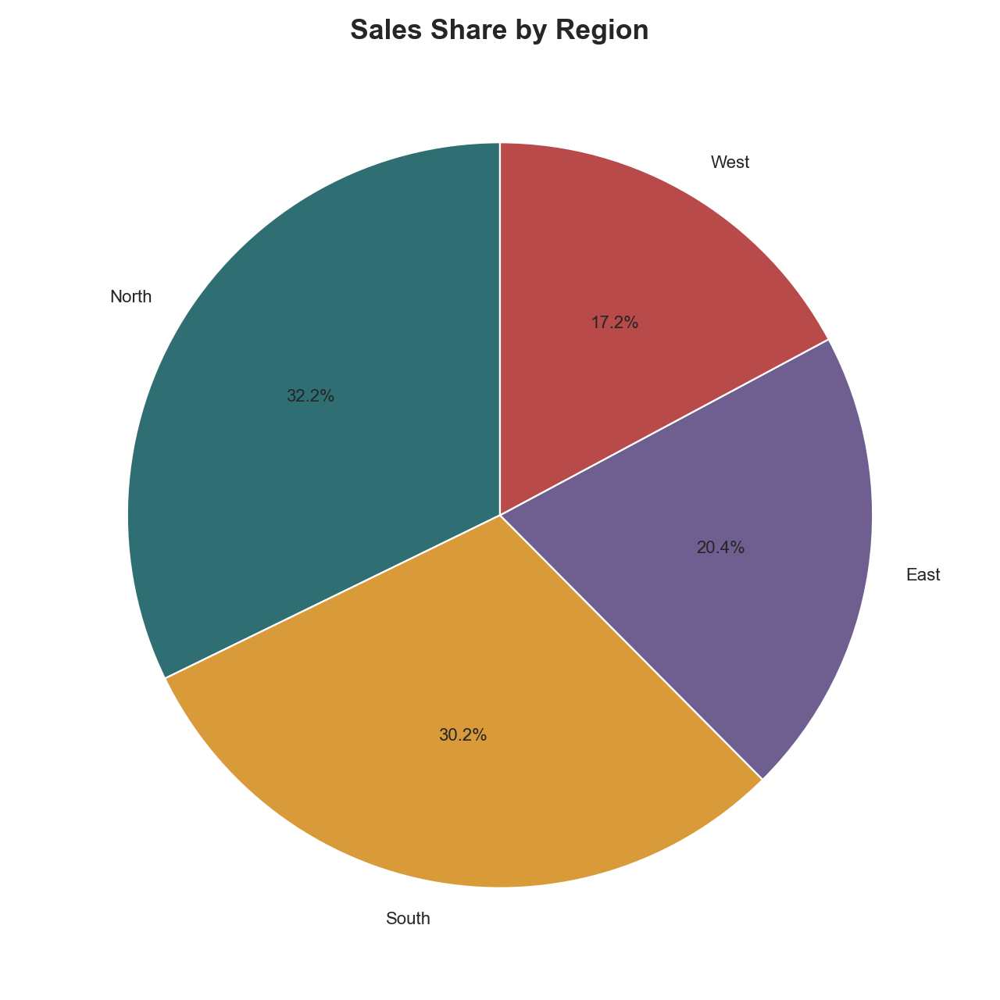

# E-commerce Sales Analysis

## Project Overview

This Week 4 data visualization project analyzes e-commerce sales data using Python. The goal is to complete a full data analysis workflow: load the dataset, validate and clean it, calculate useful business metrics, create professional charts, and write clear insights.

The project uses the provided `sales_data.csv` dataset and focuses on product sales, regional performance, and sales trends over time.

## Folder Structure

```text
.
|-- README.md
|-- main.py
|-- requirements.txt
|-- data/
|   `-- sales_data.csv
|-- visualizations/
|   |-- sales_by_product.png
|   |-- sales_trend_over_time.png
|   `-- sales_share_by_region.png
`-- report/
    `-- project_report.md
```

## Setup Instructions

1. Install Python.
2. Open a terminal in this project folder.
3. Install the required libraries:

```bash
pip install -r requirements.txt
```

4. Run the project:

```bash
python main.py
```

## Analysis Workflow

The script follows a complete data analysis pipeline:

1. Load the CSV file from `data/sales_data.csv`.
2. Validate required columns.
3. Clean dates, numbers, product names, customer IDs, and region names.
4. Check missing values, duplicate rows, and sales total accuracy.
5. Calculate sales metrics by product, region, and month.
6. Create three charts with Matplotlib.
7. Generate a Markdown report with metrics, visuals, and insights.

## Visual Documentation

### Sales by Product



### Sales Trend Over Time



### Sales Share by Region



## Technical Details

- Language: Python
- Libraries: pandas, matplotlib
- Main data structure: pandas DataFrame
- Chart types: bar chart, line chart, pie chart
- Output report format: Markdown
- Error handling:
  - Missing file check
  - Required column validation
  - Empty dataset validation
  - Date and numeric conversion checks
  - Sales total mismatch detection

## Testing Evidence

The project can be tested by running:

```bash
python main.py
```

A successful run creates:

- `visualizations/sales_by_product.png`
- `visualizations/sales_trend_over_time.png`
- `visualizations/sales_share_by_region.png`
- `report/project_report.md`

The script also prints a short completion summary in the terminal.

## Submission Checklist

- [x] Project overview
- [x] Setup instructions
- [x] Organized code structure
- [x] Data folder
- [x] Visualization folder
- [x] Report folder
- [x] At least two chart types
- [x] Written insights
- [x] Error handling and validation
- [x] Testing evidence
